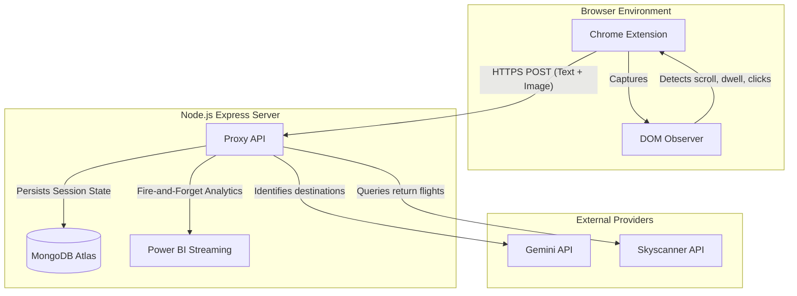

# Roam: Travel Inspiration Telemetry

Roam is a real-time behavioral telemetry system and browser extension designed to identify travel intent signals from social media platforms before active search queries occur. By passively monitoring user engagement metrics on platforms such as TikTok and Instagram, Roam aggregates intent scores and bridges the gap between passive content consumption and active flight bookings via the Skyscanner API.

## Core Architecture

The system operates on a client-server model consisting of a Chrome Extension and a centralized Express/Node.js backend. 



## Design Decisions

### 1. Centralized Backend Proxy
Initially prototyped as a local, client-side only application, the architecture was migrated to a centralized Express backend. This abstracts the API keys for external services (Gemini, Skyscanner) away from the client environment, mitigating security risks and eliminating the need for user configuration.

### 2. Anonymous Device Identification
To support cross-session continuity without requiring user authentication, the extension generates a unique UUID upon installation. This UUID is transmitted in the `x-device-id` header to associate engagement events and flight queries with a specific device, ensuring compliance with privacy standards by avoiding Personally Identifiable Information (PII).

### 3. Asynchronous Analytics Streaming
The integration with Power BI for real-time dashboards is engineered as a "fire-and-forget" process. By executing these requests asynchronously and catching exceptions silently, the core user experience and main request lifecycle remain unaffected by telemetry service downtime or rate limits.

### 4. Client-Side Throttling
Concurrency control is maintained at the extension level. The client queue prevents excessive simultaneous HTTP connections to the backend during rapid scrolling, preventing rate limit breaches on downstream APIs (Gemini, Skyscanner) and reducing the necessity for complex job queuing in the backend.

### 5. Intelligent Consolidation
To prevent feed fragmentation, detections within the same geographical region or country are dynamically consolidated into the primary aviation hub (e.g., multiple cities in France route to CDG). Massive geographic regions (e.g., US, CA, AU) are explicitly excluded from this consolidation to ensure accurate flight durations and pricing for disparate locations.

## System Components

### 1. Chrome Extension (`/extension`)
- **Content Script (`src/content.ts`)**: Monitors DOM mutations to capture social media captions, tags, and engagement metrics (dwell time, rewatches, profile clicks).
- **Background Service Worker (`src/background.ts`)**: Acts as the central coordinator, capturing screenshots, managing queues, and transmitting data to the backend.
- **Scoring Engine (`src/scorer.ts`)**: Applies weighted algorithms to raw engagement events to calculate normalized interest scores.

### 2. Backend Service (`/backend`)
- **Express Routes**: Handles `/detect`, `/flights`, `/events`, `/scores`, and `/summary` endpoints.
- **MongoDB Connector**: Persists state across browser sessions.
- **Power BI Service**: Normalizes and pushes real-time telemetry to streaming datasets.

## Build and Deployment Guide

### Prerequisites
- Node.js (v18+)
- MongoDB Atlas cluster URL
- Gemini API Key
- Skyscanner API Key
- Power BI Streaming Dataset URLs (Optional)

### Installation
The project utilizes `npm workspaces` to manage dependencies for both the frontend and backend simultaneously.

```bash
# Install dependencies from the root directory
npm install
```

### Environment Configuration
Navigate to the `backend` directory, duplicate the `.env.example` file to `.env`, and populate the environment variables.

```bash
cp backend/.env.example backend/.env
```

### Build Commands
Compile the respective sub-packages using the following root-level commands:

```bash
# Compile both extension and backend sequentially
npm run build

# Compile selectively
npm run build:extension
npm run build:backend

# Run TypeScript watcher for extension development
npm run watch:extension
```

### Running Locally
To launch the backend development server using `nodemon`:

```bash
npm run server
```
Once the server is running on `http://localhost:3000`, load the compiled `extension/dist` folder into Google Chrome as an unpacked extension.

## API Documentation Reference

The backend serves an HTML-based API reference. To view the payload schemas, endpoint specifications, and headers:
1. Start the backend server (`npm run server`).
2. Navigate to `http://localhost:3000/` in a web browser.
